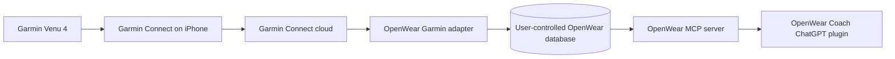

# First-party OpenWear Coach plugin plan

OpenWear Coach will be its own ChatGPT plugin. It does not depend on Fitness AI
Connector, LiftTrack, or another fitness-data plugin.

## Target personal flow

The intended supported path uses Garmin's official Activity and Health APIs.
The user authorizes Garmin once with OAuth; OpenWear never receives the Garmin
password. Normal watch-to-Garmin Connect synchronization then supplies new data
to the OpenWear adapter. Garmin API access requires acceptance into the
[Garmin Connect Developer Program](https://developer.garmin.com/gc-developer-program/).

## What exists now

- A local SQLite and CSV core with nine MCP tools.
- A validated first-party plugin package at `plugins/openwear-coach/`.
- A packaged Strength Coach skill with explicit non-medical guardrails.
- A durable strength-set identity that separates dates and data sources and
  migrates the original pre-alpha schema without dropping records.
- A verified local Streamable HTTP MCP endpoint at
  `http://127.0.0.1:8000/mcp`.

## What remains

1. Register the local MCP server in ChatGPT developer mode and obtain the
   user-specific `plugin_asdk_app...` connection ID.
2. Add that mapping locally as `.app.json` and expose the plugin through a local
   marketplace. Do not commit the user-specific connection ID.
3. Apply for Garmin Activity and Health API access and implement OAuth, consent,
   revocation, push ingestion, reconciliation, and deletion.
4. Add a provider adapter and normalized Garmin fixtures before using personal
   data. Raw Garmin, Apple Health, FIT, location, or device-identifier exports
   must stay outside Git.
5. Run a Venu 4 verification using synthetic data first, then a minimal
   read-only personal dataset after authorization.

## Private development connection

For the current Windows laptop, run OpenWear locally and register its MCP URL in
ChatGPT developer mode. If a ChatGPT surface cannot reach the loopback endpoint,
OpenAI's [Secure MCP Tunnel](https://developers.openai.com/api/docs/guides/secure-mcp-tunnels)
is the private, outbound-only development option. It is for private testing, not
public plugin publication, and requires an OpenAI Platform tunnel identity and
runtime API key.

## Approval-free fallback

An Apple Health Shortcut can place a bounded JSON snapshot in iCloud Drive for
the Windows importer. This remains first-party and local, but it is only a
temporary personal bridge: Garmin's Apple Health export is incomplete and
Garmin Connect must be opened on the iPhone for data transfer. It is not a
substitute for the official Garmin API path.

## Data and safety rules

- Never collect Garmin credentials or automate the Garmin website.
- Request the smallest read-only scopes first.
- Keep health data local by default; encrypt tokens and any hosted data.
- Make disconnect, export, and deletion explicit and testable.
- Treat readiness and wearable measurements as coaching estimates, not medical
  advice.
