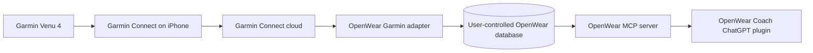

# First-party OpenWear Coach plugin plan

OpenWear Coach will be its own local-first plugin and MCP toolset. It does not
depend on Fitness AI Connector, LiftTrack, or another fitness-data plugin.

## Target personal flow

The intended supported path uses Garmin's official Activity and Health APIs.
The user authorizes Garmin once with OAuth; OpenWear never receives the Garmin
password. Normal watch-to-Garmin Connect synchronization then supplies new data
to the OpenWear adapter. Garmin API access requires acceptance into the
[Garmin Connect Developer Program](https://developer.garmin.com/gc-developer-program/).

## What exists now

- A local SQLite and CSV core with nine MCP tools.
- A validated first-party plugin package at `plugins/openwear-coach/`.
- A packaged Strength Coach skill with explicit non-medical guardrails.
- A durable strength-set identity that separates dates and data sources and
  migrates the original pre-alpha schema without dropping records.
- Verified STDIO and loopback Streamable HTTP MCP transports.
- A project-scoped `.codex/config.toml` that starts the preferred STDIO server,
  opens no port, and initially exposes only `get_data_coverage`.
- A fail-closed HTTP guard that rejects LAN, wildcard, hostname, and privileged
  bindings.

## No-extra-cost desktop route

For the current Windows laptop, ChatGPT desktop and Codex should start OpenWear
directly over STDIO from the checked-in project configuration. It uses an
isolated synthetic SQLite database and does not require a listening port,
public endpoint, OpenAI Platform API key, Secure MCP Tunnel, Garmin
authorization, or personal health data.

After opening this trusted project, restart the desktop host and create a new
task in the project. Confirm `openwear_local` under `/mcp`, then first call only
`get_data_coverage`. Reopening a task created before the configuration change
does not rebuild its MCP inventory. The loopback HTTP endpoint remains
available solely for manual development through `scripts/start-local.ps1`; it
is not the preferred personal route. See `SECURITY.md` for the threat model and
residual risks.

## What remains

1. Restart the desktop host, create a new task inside this project, and confirm
   the project-scoped STDIO server under `/mcp`; call only
   `get_data_coverage` against the empty database.
2. Optionally add the existing skills-only package to a local marketplace and
   start a new task with the coaching skill.
3. Apply for Garmin Activity and Health API access and implement OAuth, consent,
   revocation, push ingestion, reconciliation, and deletion.
4. Add a provider adapter and normalized Garmin fixtures before using personal
   data. Raw Garmin, Apple Health, FIT, location, or device-identifier exports
   must stay outside Git.
5. Run a Venu 4 verification using synthetic data first, then a minimal
   read-only personal dataset after authorization.

## Deferred web connection

The ChatGPT web developer-mode form rejects a plain loopback URL. OpenAI's
[Secure MCP Tunnel](https://developers.openai.com/api/docs/guides/secure-mcp-tunnels)
would bridge it privately, but requires a Platform tunnel identity and runtime
API key. The user requires no additional charges, so this web route is deferred:
do not create a runtime key, run a tunnel client, add credits, or enable
auto-reload. If the user later permits a separately billed Platform route, first
confirm pricing and authorization at that time.

## Approval-free fallback

An Apple Health Shortcut can place a bounded JSON snapshot in iCloud Drive for
the Windows importer. This remains first-party and local, but it is only a
temporary personal bridge: Garmin's Apple Health export is incomplete and
Garmin Connect must be opened on the iPhone for data transfer. It is not a
substitute for the official Garmin API path.

## Data and safety rules

- Never collect Garmin credentials or automate the Garmin website.
- Request the smallest read-only scopes first.
- Keep health data local by default; encrypt tokens and any hosted data.
- Make disconnect, export, and deletion explicit and testable.
- Treat readiness and wearable measurements as coaching estimates, not medical
  advice.
